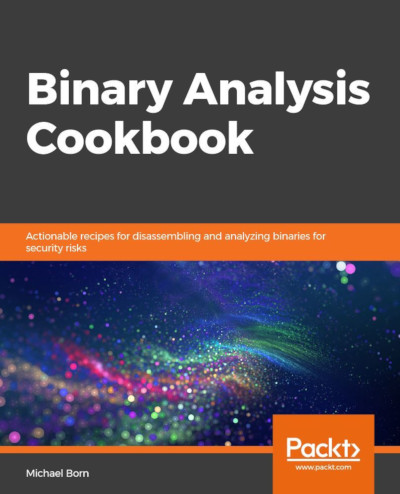

## Pick Up Your Copy Today
Are you a beginner at binary analysis? Have you always wanted to learn the intricices of binary analysis but don't know where to find resources to help you? Look no further! I wrote Binary Analysis Cookbook to help those beginning their journey in learning binary analysis. This book is beginner friendly on purpose but even technology veterans will find something useful for their day to day tasks. I had to really hunt for resources to learn this topic when I was a beginner and I refuse to let that happen to you. So, if you are interested in learning ELF binary analysis, please pick up a copy of the book from one of these sellers. 

* [Amazon.com](https://www.amazon.com/Binary-Analysis-Cookbook-Actionable-disassembling/dp/1789807603/ref=asc_df_1789807603/?tag=hyprod-20&linkCode=df0&hvadid=385558156731&hvpos=1o1&hvnetw=g&hvrand=4489947837441001572&hvpone=&hvptwo=&hvqmt=&hvdev=c&hvdvcmdl=&hvlocint=&hvlocphy=9024587&hvtargid=pla-825215733305&psc=1&tag=&ref=&adgrpid=78303889346&hvpone=&hvptwo=&hvadid=385558156731&hvpos=1o1&hvnetw=g&hvrand=4489947837441001572&hvqmt=&hvdev=c&hvdvcmdl=&hvlocint=&hvlocphy=9024587&hvtargid=pla-825215733305)
* [Packt Publishing](https://packtpub.com/security/binary-analysis-cookbook)
* [Barnes and Noble](https://www.barnesandnoble.com/w/binary-analysis-cookbook-michael-born/1133738442?ean=9781789807608)
* [Google Play Store Books](https://play.google.com/store/books/details/Michael_Born_Binary_Analysis_Cookbook?id=OlqxDwAAQBAJ&hl=en_US)
* [Apple iBooks](https://books.apple.com/us/book/binary-analysis-cookbook/id1480468422)
