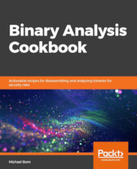

## Pick Up Your Copy Today

 Are you a beginner at binary analysis? Always wanted to learn the intricices of binary analysis but don't know where to find resources to help you? Look no further! I wrote Binary Analysis Cookbook to help those beginning their journey in learning binary analysis. This book is beginner friendly on purpose. I had to really hunt for resources to learn this topic when I was a beginner and I refuse to let that happen to you. So, if you are interested in learning this topic, please pick up a copy of the book from one of these sellers.

Packt Publishing

Google Play Store Books

Apple iBooks
